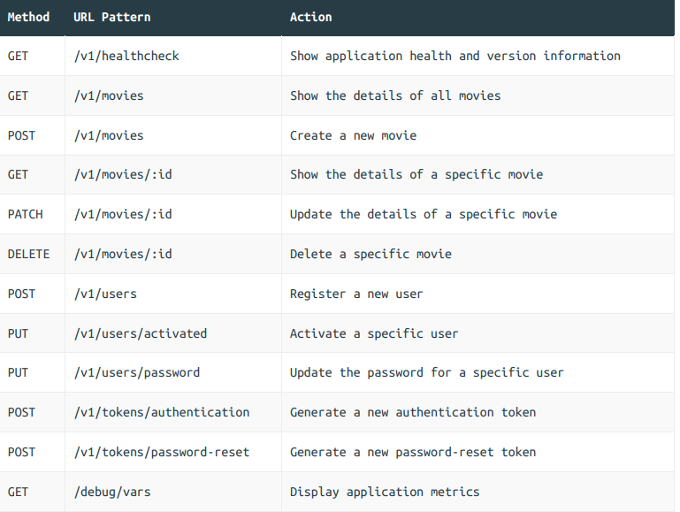

# Greenlight API

A RESTful API service project based on the book "Let's Go Further" implementing advanced patterns and best practices for Go applications.

## Features

- RESTful API design
- Advanced error handling
- Structured logging
- Database migrations
- Authentication and authorization
- Rate limiting
- Metrics and monitoring
- Graceful shutdown

## Requirements

- Go 1.19+
- PostgreSQL

